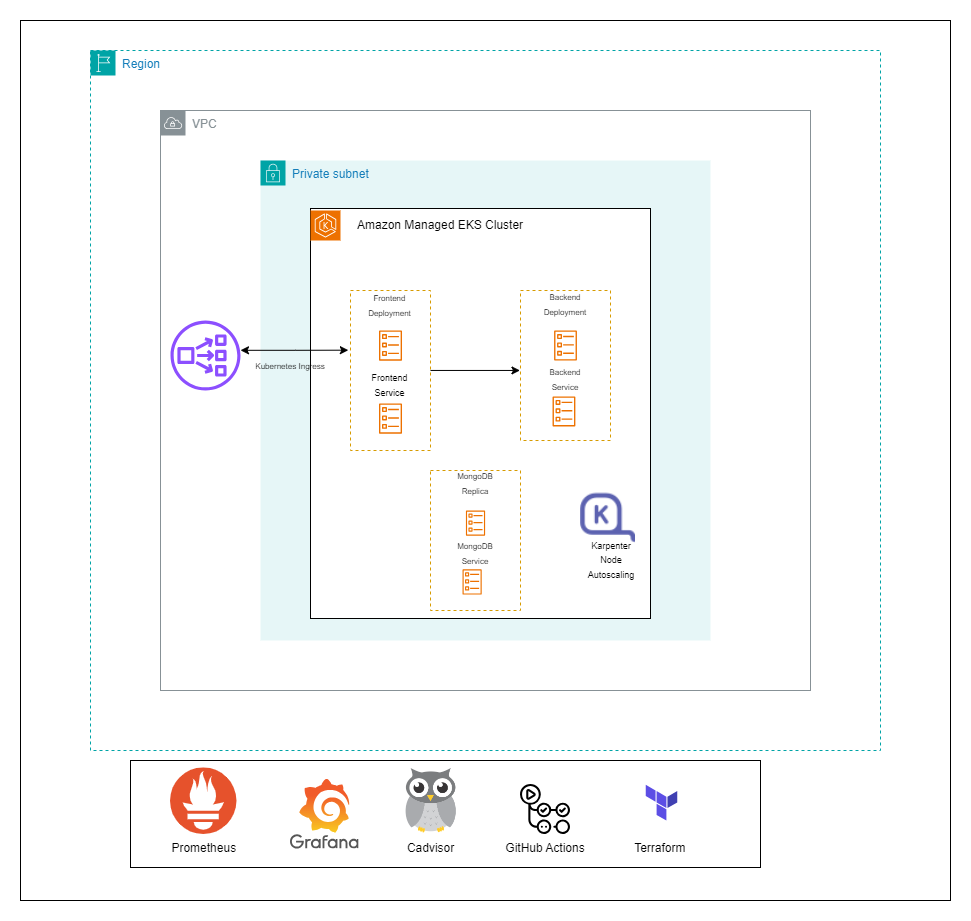

# MERN Ecommerce Project

## Codebase Description

An ecommerce store built with MERN stack, and utilizes third party API's. This ecommerce store enable three main different flows or implementations:

1. Buyers browse the store categories, products and brands
2. Sellers or Merchants manage their own brand component
3. Admins manage and control the entire store components 


* features:
  * Node provides the backend environment for this application
  * Express middleware is used to handle requests, routes
  * Mongoose schemas to model the application data
  * React for displaying UI components
  * Redux to manage application's state
  * Redux Thunk middleware to handle asynchronous redux actions


## Database Seed

* The seed command will create an admin user in the database
* The email and password are passed with the command as arguments
* Like below command, replace brackets with email and password. 
* For more information, see code [here](server/utils/seed.js)

```
npm run seed:db [email-***@****.com] [password-******] // This is just an example.
```

## Demo

This application is deployed on Vercel Please check it out :smile: [here](https://mern-store-gold.vercel.app).

See admin dashboard [demo](https://mernstore-bucket.s3.us-east-2.amazonaws.com/admin.mp4)

### Install

Some basic Git commands are:

```
$ git clone https://github.com/mohamedsamara/mern-ecommerce.git
$ cd project
$ npm install
```

### Start development

```
$ npm run dev
```

### Simple build for production

```
$ npm run build
```

### Run build for production

```
$ npm start
```


## Languages & tools

- [Node](https://nodejs.org/en/)

- [Express](https://expressjs.com/)

- [Mongoose](https://mongoosejs.com/)

- [React](https://reactjs.org/)

- [Webpack](https://webpack.js.org/)


## Cloud Infrastructure Deployment

AWS cloud is used to deploy this application using Amazon EKS. A quick view of what the cloud archtecture looks like is given below:



The archtecture consists of the following services


| Name | Shortcode |
| --- | --- | 
| VPC | :heavy_check_mark: |
| 2 private Subnets | :heavy_check_mark:|
| 2 Public Subnets  | :heavy_check_mark:|
| Internet Gateway  | :heavy_check_mark:|
| NAT Gateway       | :heavy_check_mark:|
| EKS Cluster       | :heavy_check_mark:|
| IAM Roles         | :heavy_check_mark:|
| EC2 (k8s Nodes)     | :heavy_check_mark:|
| Cloud watch log group | :heavy_check_mark:|

## DevOps Practice

The infrastructure can be deployed using github actions utilizing the power of Infrastructure as code and packaging a pipeline to bootstrap the infrastructure and deploy the application through a CI pipeline. 

The Github actions CI pipeline also builds the application code and push to a docker image. 

## Monitoring

See `/monitoring` folder readme...


## Kubernetes Node Autoscaling

See `/k8s` folder readme...

