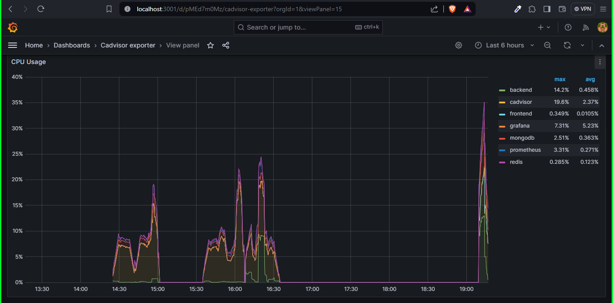
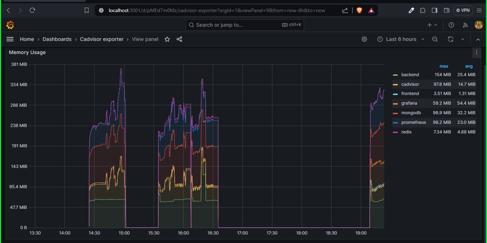
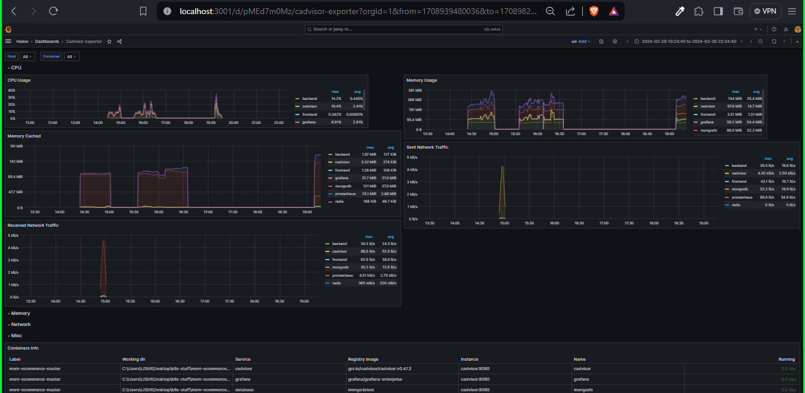

## Deployment and Monitoring of a MERN Stack E-commerce Store with Docker Compose

#### Introduction
This documentation provides a step-by-step guide on deploying a MERN stack-based e-commerce store across a server or cluster using Docker Compose. It details the process of setting up microservices, configuring Docker containers, and implementing monitoring tools for comprehensive observability, including logs, metrics, and traces.

#### Prerequisites
- Docker and Docker Compose installed on your server or development machine.
- Basic understanding of the MERN stack (MongoDB, Express.js, React, Node.js).
- Familiarity with Prometheus, Grafana, and Loki for monitoring and observability.

#### Architecture Overview
Our application is divided into three microservices:

1. Frontend Service: Built with React.
2. Backend Service: Built with Express.js and Node.js.
3. Database Service: MongoDB database.

We use Docker Compose to manage these microservices in containers, ensuring easy deployment and scalability. Monitoring is achieved through Prometheus (metrics collection), cAdvisor (container metrics), and Loki (logs aggregation), with Grafana for visualization.

#### Step 1: Microservices Setup
<b>Creating Dockerfiles</b>
Each microservice (Frontend, Backend, Database) requires a Dockerfile. This file defines the environment in which the microservice will run, including the base image, dependencies, and startup commands.

- <b>Frontend Dockerfile:</b> Sets up the Node.js environment and builds the React application.
- <b>Backend Dockerfile:</b> Configures Node.js for the Express server.
- <b>Database Dockerfile:</b> Uses the official MongoDB image.
<b>Docker Compose Configuration</b>
docker-compose.yml is created to define and run the multi-container Docker application. It specifies the services, networks, and volumes, linking the three microservices and ensuring they can communicate effectively.

#### Step 2: Monitoring Setup
<b>Prometheus Configuration</b>
Prometheus is configured for collecting and storing metrics. A prometheus.yml file is created to define the scraping intervals and targets, including our microservices and cAdvisor for container metrics.

<b>cAdvisor Integration</b>
cAdvisor is deployed as a Docker container to monitor, analyze, and gather metrics from other containers. It's specified in the docker-compose.yml, allowing Prometheus to scrape container metrics.

<b>Grafana Dashboard Setup</b>
Grafana is used for visualizing the data collected by Prometheus and cAdvisor. After setting up Grafana, we import or create dashboards to visualize metrics such as memory, CPU usage, and network I/O.

<b>Loki for Logs Aggregation</b>
Loki is integrated to aggregate and query logs from our microservices. It's set up alongside Prometheus and Grafana, providing a unified platform for observability.

#### Step 3: Deployment
With the Dockerfiles and docker-compose.yml configured, deploy the application by running:
```bash
docker-compose up -d
```

This command builds the images (if not already done) and starts the microservices in detached mode.

#### Step 4: Monitoring Dashboards 
We accessed Grafana at http://localhost:3001 to view dashboards displaying real-time metrics. We used cAdvisor explorer to create this well defined view of

CPU Usage

Memory Usage

Some other metrics
